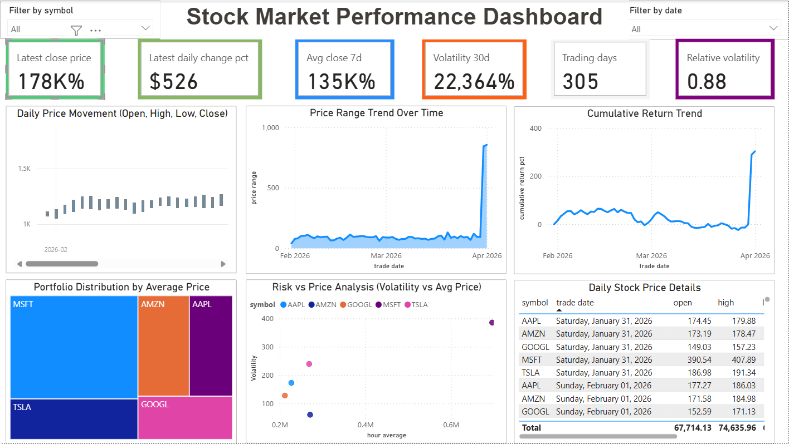
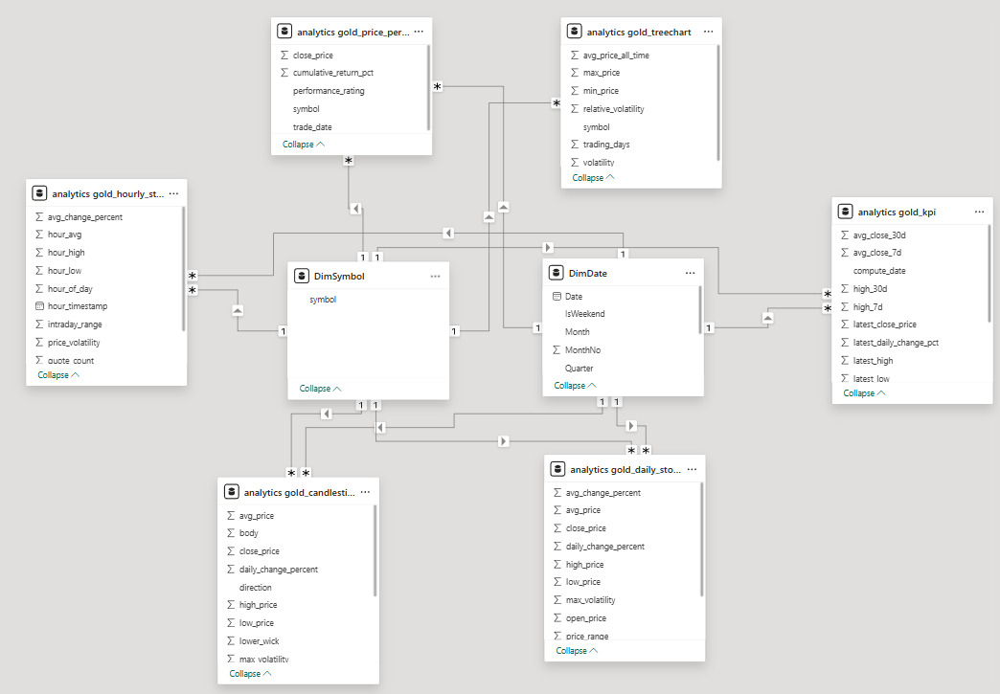

# Stock Market Stream Pipeline

A real-time stock market data engineering project using Kafka, MinIO, Airflow, dbt, PostgreSQL/Snowflake, and Power BI.

This project follows a Medallion Architecture approach:
- Bronze: raw events (immutable)
- Silver: cleaned and deduplicated
- Gold: analytics-ready tables for BI

## Inspiration

The structure is inspired by common open-source GitHub data engineering patterns:
- Event streaming with Kafka producer/consumer
- Data lake landing zone with S3-compatible storage (MinIO)
- Orchestration with Airflow
- SQL transformations with dbt
- BI semantic layer from Gold models

## Architecture

1. Producer publishes stock quote events to Kafka.
2. Consumer reads Kafka events and stores raw JSON in MinIO.
3. Airflow DAG loads Bronze files from MinIO into warehouse Bronze table.
4. dbt transforms Bronze -> Silver -> Gold.
5. Power BI reads Gold tables for dashboards.

## Project Visuals

Use this section to add your final screenshots and diagrams.

### Dashboard Preview

<!-- Replace with your real image path -->


### Power BI Model View

<!-- Replace with your real image path -->


### Pipeline Architecture Diagram

<!-- Replace with your real image path -->


## Warehouse Modes (Important)

This project supports two warehouse targets via environment variable `TARGET_WAREHOUSE`:

- `postgres` (default): recommended for local development and budget-friendly runs.
- `snowflake`: optional mode for cloud warehouse testing.

The Airflow DAG `minio_to_snowflake_bronze` automatically routes writes based on this setting.

## Project Structure

```text
Stock_Market_Stream/
  consumer/
    consumer.py
  producer/
    producer.py
  dags/
    minio_to_snowflake.py
  dbt_stockes/
    dbt_stockes/
      models/
        bronze/
        silver/
        gold/
  powerbi/
    Stock_Market_Dashboard.pbix
  docker-compose.yml
  .env
  .gitignore
```

## Setup

### 1) Configure environment

Create/update `.env` with your local credentials and runtime settings.

Key variables:
- `TARGET_WAREHOUSE` (`postgres` or `snowflake`)
- `POSTGRES_*`
- `MINIO_*`
- `KAFKA_*`
- `FINNHUB_API_KEY`
- `SNOWFLAKE_*` (only needed when Snowflake mode is used)

### 2) Start infrastructure

```powershell
docker compose up -d
```

### 3) Run ingestion

Producer (live mode):
```powershell
python producer/producer.py --mode live
```

Producer (historical backfill):
```powershell
python producer/producer.py --mode backfill --days 60 --interval-minutes 60
```

Consumer:
```powershell
python consumer/consumer.py
```

### 4) Run orchestration and transformations

- Trigger Airflow DAG: `minio_to_snowflake_bronze`
- Run dbt:
```powershell
cd dbt_stockes/dbt_stockes
..\..\venv\Scripts\dbt.exe run
..\..\venv\Scripts\dbt.exe test
```

## dbt Layers

- Bronze model: `bronze_stg_stock_quotes`
- Silver model: `silver_clean_stock_quotes`
- Gold models:
  - `gold_daily_stock_summary`
  - `gold_hourly_stock_metrics`
  - `gold_kpi`
  - `gold_candlestick_data`
  - `gold_price_performance`
  - `gold_treechart`
  - `gold_candlestick`

## Power BI

Use Gold tables as the semantic layer.
Recommended dimensions:
- `DimSymbol`
- `DimDate`

Avoid direct fact-to-fact relationships. Use single-direction filtering from dimensions to facts.

## Security and Git

- Secrets are stored in `.env`.
- `.env`, logs, dbt artifacts, virtual env, and Power BI binary files are ignored by `.gitignore`.
- If secrets were ever committed previously, rotate them.

## Troubleshooting

1. Airflow DAG fails with bucket errors:
- Ensure MinIO is running and bucket bootstrap executes.

2. dbt points to wrong profile:
- Verify profile path and target are set to PostgreSQL for local mode.

3. Power BI date issues:
- Confirm `trade_date` is used from Gold tables and data types are Date.

4. Snowflake mode fails:
- Check `SNOWFLAKE_USER`, `SNOWFLAKE_PASSWORD`, `SNOWFLAKE_ACCOUNT`, and warehouse status.

## License

For internship/educational usage. Add a license file if you plan to publish publicly.
